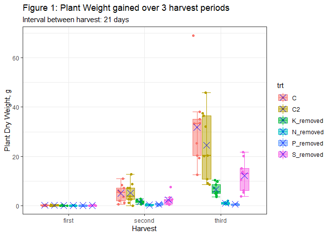
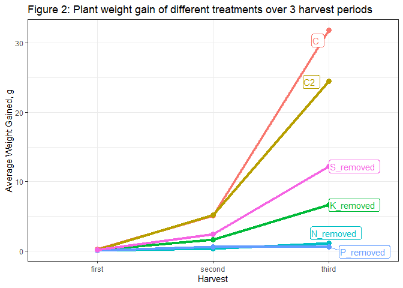
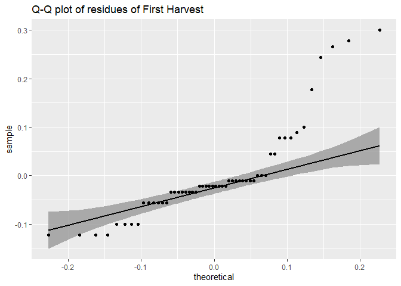
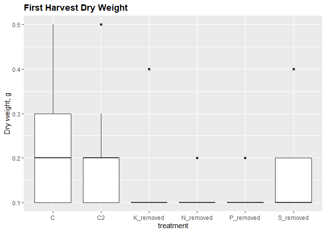
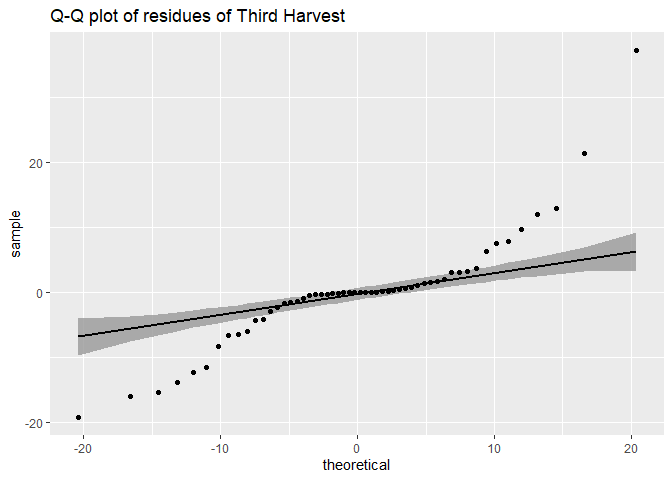

How are various basic soil nutrients affecting maize growth?
================
Kar Ng
2021

-   [1 SUMMARY](#1-summary)
-   [2 R PACKAGES](#2-r-packages)
-   [3 INTRODUCTION](#3-introduction)
-   [4 EXPERIMENTAL DESIGN SUMMARY](#4-experimental-design-summary)
-   [5 DATA PREPARATION](#5-data-preparation)
    -   [5.1 SQL: Data Cleaning](#51-sql-data-cleaning)
    -   [5.2 R: Data Upload](#52-r-data-upload)
    -   [5.3 R: Data Exploration](#53-r-data-exploration)
    -   [5.4 R: Data Manipulation](#54-r-data-manipulation)
-   [6 EXPLORATORY DATA ANALYSIS
    (EDA)](#6-exploratory-data-analysis-eda)
-   [7 STATISTICAL ANALYSIS](#7-statistical-analysis)
    -   [7.1 First harvest with
        Kruskal-Wallies](#71-first-harvest-with-kruskal-wallies)
    -   [7.2 Second harvest: Kruskal-Wallies + Dunn’s
        test](#72-second-harvest-kruskal-wallies--dunns-test)
    -   [7.3 Third harvest: Kruskal-Wallies + Dunn’s
        test](#73-third-harvest-kruskal-wallies--dunns-test)
    -   [7.4 STATISTICAL SUMMARY](#74-statistical-summary)
    -   [8 CONCLUSION](#8-conclusion)
-   [9 LEGALITY](#9-legality)
-   [10 REFERENCE](#10-reference)

------------------------------------------------------------------------


------------------------------------------------------------------------

Reading time: 12 minutes

## 1 SUMMARY

The main purpose of this project is to demonstrate my experimentation
and analytical skills in R and SQL using a dataset that I collected from
a maize experiment during my university program from the University of
Queensland in 2015. This personal project improves and reforges the
original project with more data cleaning, data manipulation, better
visualisations, and statistical tests.

The maize study had a CRD system (completely randomised design) and was
carried out in the glasshouse of the university. There were 6
treatments, and 9 replicates for each treatment. Each treatment has soil
nutrient content different from each other. Plant weight was the
responding variable. All maize crops were harvested, oven dried, and
weighted during 3 harvest periods. 2 visualisations were synthesised to
observe overall trend, Q-Q plot and Shapiro-Wilk test were used to test
for residual normality, Levene’s test was applied to test for group
variances, Kruskal-wallis and Dunn’s test were selected as the omnibus
and post-hoc test.

Result reveals that nitrogen and phosphorus are the most limiting
nutrients among the treatments in the experiment. Maize plants in soils
that do not have nitrogen and phosphorus had the significantly lower
growth compared to other treatments. Removing potassium and sulphur
affects plant growth as well but the growth was still significantly
higher than nitrogen and phosphorus limited soil. However, the growth of
plants in soil that has potassium and sulphur removed was still
significantly lower than the soils that have the balanced nutrient.

*Highlights* <br/>


<br/>

## 2 R PACKAGES

R packages loaded in this project include tidyverse packages (ggplot2,
dplyr, tidyr, readr, purrr, tibble, stringr, and forcats), skimr,
kabbleExtra, ggrepel, qqplotr, DescTools, and dunn.test.

``` r
library(tidyverse)
library(skimr)
library(kableExtra)
library(ggrepel)
library(qqplotr)
library(DescTools)
library(dunn.test)
```

## 3 INTRODUCTION

Plants require a variety of nutrients for healthy growth and yield. The
goal of this project is to investigate which of the 6 plant-essential
soil nutrients affects plant growth the most. This experiment was
actually mine, and has already been carried out in a glasshouse in the
University of Queensland (UQ) Gatton campus in 2015, I am revisiting it
and reforging it with relevant skills in R, SQL, and statistical
analysis.

It was a potting experiment, maize was planted in various pots that have
different nutrient contents. The glasshouse has a controlled,
homogeneous environment, it was designed and built for experimentation
purposes. There were 54 pots allocated for the experiment. There were 6
treatments in the experiment. Each treatment had 9 replicates. In the
experiment, the position of each pot was completely randomised in the
allocated bench in the glasshouse. It was a 75-days experiment,
randomisation was carried out at least 3 times each week during
watering.

Each of the treatments are:

``` r
Treatment <- c("T1",
               "T2",
               "T3",
               "T4",
               "T5",
               "T6")

Description <- c("Optimal nutrient content",
                 "Optimal nutrient content x 2",
                 "nitrogen deficiency (-N) ",
                 "phosphorus deficiency (-P)",
                 "potassium deficiency (-K)",
                 "sulphur deficiency (-S)")

Detail <- c("Nutrients added are balanced",
            "Doubling the nutrient content in T1",
            "N is important for cell devision, photosynthesis, and act as a building block of amino acids for plants (William and Mattson (1980).)",
            "P is important For plant photosynthesis, root formation, and growth (Hameeda et al. 2006)",
            "K is an important element that improves nutrient intake of plants and to enhance disease resistance (Wu et al .2004)",
            "S helps to develop essential enzymes and vitamins for plants")

data.frame(Treatment, Description, Detail) %>% 
  kbl() %>% 
  kable_classic("hover", "border")
```

<table class=" lightable-classic lightable-hover" style="font-family: border; margin-left: auto; margin-right: auto;">
<thead>
<tr>
<th style="text-align:left;">
Treatment
</th>
<th style="text-align:left;">
Description
</th>
<th style="text-align:left;">
Detail
</th>
</tr>
</thead>
<tbody>
<tr>
<td style="text-align:left;">
T1
</td>
<td style="text-align:left;">
Optimal nutrient content
</td>
<td style="text-align:left;">
Nutrients added are balanced
</td>
</tr>
<tr>
<td style="text-align:left;">
T2
</td>
<td style="text-align:left;">
Optimal nutrient content x 2
</td>
<td style="text-align:left;">
Doubling the nutrient content in T1
</td>
</tr>
<tr>
<td style="text-align:left;">
T3
</td>
<td style="text-align:left;">
nitrogen deficiency (-N)
</td>
<td style="text-align:left;">
N is important for cell devision, photosynthesis, and act as a building
block of amino acids for plants (William and Mattson (1980).)
</td>
</tr>
<tr>
<td style="text-align:left;">
T4
</td>
<td style="text-align:left;">
phosphorus deficiency (-P)
</td>
<td style="text-align:left;">
P is important For plant photosynthesis, root formation, and growth
(Hameeda et al. 2006)
</td>
</tr>
<tr>
<td style="text-align:left;">
T5
</td>
<td style="text-align:left;">
potassium deficiency (-K)
</td>
<td style="text-align:left;">
K is an important element that improves nutrient intake of plants and to
enhance disease resistance (Wu et al .2004)
</td>
</tr>
<tr>
<td style="text-align:left;">
T6
</td>
<td style="text-align:left;">
sulphur deficiency (-S)
</td>
<td style="text-align:left;">
S helps to develop essential enzymes and vitamins for plants
</td>
</tr>
</tbody>
</table>

<br/>

There were 5 maize plants planted in each pot. All plants were seeded in
the same time. First harvest was 30 days after the day of seeding,
second harvest happened 21 days after the first harvest, and the third
harvest happened 21 days after the second harvest. Plants were weighted
and recorded during the 3 harvest days. During each time of harvest,
harvested plants were oven dried at 60°C for 48 hours and the dry
weights were recorded.

## 4 EXPERIMENTAL DESIGN SUMMARY

-   **Crop**: Maize  
-   **Experimental Design**: Completely Randomised Design (CRD)  
-   **Experimental unit**: Pot (unit that receive 1 treatment)  
-   **Independent variable**: Nutrient treatment  
-   **Levels of Independent variable**: 6  
-   **Number of replication**: 9  
-   **Dependent variable**: Plant weight (g)

It was a CRD system, controlling environmental variation is very crucial
to the experiment result. Environmental noises had been taken care of by
having the experiment carried out in the glasshouse that has the common
environmental aspects controlled as well as under the cares of mine and
my team. Maximum care had been given to each of this uncontrollable
factors to reduces these extraneous noises, for example, the type of
instruments used and observers’ fatigue. The environmental error should
has been minimized to only uncontrollable one, include inherent generic
variances between individual plant.

## 5 DATA PREPARATION

### 5.1 SQL: Data Cleaning

The maize dataset has been uploaded to BigQuery by me. BigQuery is an
online database that store and allow users to work with stored datasets
with SQL programming language.

In this section, I search the maize dataset on the BigQuery, clean it
(though I can also complete the same cleaning in R), download it, and
upload it onto R. If you are unfamiliar with BigQuery, you can just
follow my description.

Following is the BigQuery database showing the maize dataset.

<br/>
<<<<<<< HEAD


=======

>>>>>>> 41c8ed50a165be5ac5d0cf53be45e2874ad7f975
<br/>

The maize dataset has columns “Harvest”, “Treatments”, “rep”,
“Dwt\_*g*”, “string\_field\_4”, and “int64\_field\_5”. Several cleaning
tasks I have identified, include:

-   Removing the first 4 blank rows.  
-   Removing columns “string\_field\_4”, and “int64\_field\_5”. The 63
    was a upload error and need to be cleaned up.  
-   Renaming all columns (Optional).
    -   “harvest” to “harv”  
    -   “treatment” to “trt”  
    -   “Dwt\_*g*” to “Dwt\_g”. It stands for “dry weight, gram”.  
-   Renaming levels of Harvest and Treatments to make them more
    intuitive.
    -   Harvest: From “1” to “first”, “2” to “second”, “3” to “third”  
    -   Treatment:

``` r
From <- c("T1", "T2", "T3", "T4", "T5", "T6")
To <- c("C (recall: balanced nutrients added)", 
        "2C (recall: double the nutrients added to C)", 
        "N_removed",
        "O_removed",
        "K_removed",
        "S_removed")

data.frame(From, To) %>% 
  kbl() %>% 
  kable_styling(bootstrap_options = c("hover", "bordered", "stripped"))
```

<table class="table table-hover table-bordered" style="margin-left: auto; margin-right: auto;">
<thead>
<tr>
<th style="text-align:left;">
From
</th>
<th style="text-align:left;">
To
</th>
</tr>
</thead>
<tbody>
<tr>
<td style="text-align:left;">
T1
</td>
<td style="text-align:left;">
C (recall: balanced nutrients added)
</td>
</tr>
<tr>
<td style="text-align:left;">
T2
</td>
<td style="text-align:left;">
2C (recall: double the nutrients added to C)
</td>
</tr>
<tr>
<td style="text-align:left;">
T3
</td>
<td style="text-align:left;">
N\_removed
</td>
</tr>
<tr>
<td style="text-align:left;">
T4
</td>
<td style="text-align:left;">
O\_removed
</td>
</tr>
<tr>
<td style="text-align:left;">
T5
</td>
<td style="text-align:left;">
K\_removed
</td>
</tr>
<tr>
<td style="text-align:left;">
T6
</td>
<td style="text-align:left;">
S\_removed
</td>
</tr>
</tbody>
</table>

Following SQL code complete all the cleaning tasks at once.

<br/>
<<<<<<< HEAD


=======

>>>>>>> 41c8ed50a165be5ac5d0cf53be45e2874ad7f975
<br/>

After cleaning, the dataset is downloaded to my relevant local file.

### 5.2 R: Data Upload

Following code uploaded the SQL-cleaned maize dataset onto R (click the
right button). Following table is the result of successful data import.

``` r
maize <- read_csv("maize_SQL_cleaned.csv")
maize
```

    ## # A tibble: 162 x 4
    ##    harv  trt     rep Dwt_g
    ##    <chr> <chr> <dbl> <dbl>
    ##  1 first C         1   0.2
    ##  2 first C         2   0.1
    ##  3 first C         3   0.2
    ##  4 first C         4   0.1
    ##  5 first C         5   0.3
    ##  6 first C         6   0.1
    ##  7 first C         7   0.4
    ##  8 first C         8   0.5
    ##  9 first C         9   0.1
    ## 10 first C2        1   0.2
    ## # ... with 152 more rows

### 5.3 R: Data Exploration

The dataset has 162 rows of data and 4 columns of variables. There are 2
character variables, the “harv” (harvest) and the “trt” (treatment), and
2 numerical variables, the “rep” (replication) and “Dwt\_g” (dry weight,
gram).

------------------------------------------------------------------------

``` r
skim_without_charts(maize)
```

<table style="width: auto;" class="table table-condensed">
<caption>
Data summary
</caption>
<thead>
<tr>
<th style="text-align:left;">
</th>
<th style="text-align:left;">
</th>
</tr>
</thead>
<tbody>
<tr>
<td style="text-align:left;">
Name
</td>
<td style="text-align:left;">
maize
</td>
</tr>
<tr>
<td style="text-align:left;">
Number of rows
</td>
<td style="text-align:left;">
162
</td>
</tr>
<tr>
<td style="text-align:left;">
Number of columns
</td>
<td style="text-align:left;">
4
</td>
</tr>
<tr>
<td style="text-align:left;">
\_\_\_\_\_\_\_\_\_\_\_\_\_\_\_\_\_\_\_\_\_\_\_
</td>
<td style="text-align:left;">
</td>
</tr>
<tr>
<td style="text-align:left;">
Column type frequency:
</td>
<td style="text-align:left;">
</td>
</tr>
<tr>
<td style="text-align:left;">
character
</td>
<td style="text-align:left;">
2
</td>
</tr>
<tr>
<td style="text-align:left;">
numeric
</td>
<td style="text-align:left;">
2
</td>
</tr>
<tr>
<td style="text-align:left;">
\_\_\_\_\_\_\_\_\_\_\_\_\_\_\_\_\_\_\_\_\_\_\_\_
</td>
<td style="text-align:left;">
</td>
</tr>
<tr>
<td style="text-align:left;">
Group variables
</td>
<td style="text-align:left;">
None
</td>
</tr>
</tbody>
</table>

**Variable type: character**

<table>
<thead>
<tr>
<th style="text-align:left;">
skim\_variable
</th>
<th style="text-align:right;">
n\_missing
</th>
<th style="text-align:right;">
complete\_rate
</th>
<th style="text-align:right;">
min
</th>
<th style="text-align:right;">
max
</th>
<th style="text-align:right;">
empty
</th>
<th style="text-align:right;">
n\_unique
</th>
<th style="text-align:right;">
whitespace
</th>
</tr>
</thead>
<tbody>
<tr>
<td style="text-align:left;">
harv
</td>
<td style="text-align:right;">
0
</td>
<td style="text-align:right;">
1
</td>
<td style="text-align:right;">
5
</td>
<td style="text-align:right;">
6
</td>
<td style="text-align:right;">
0
</td>
<td style="text-align:right;">
3
</td>
<td style="text-align:right;">
0
</td>
</tr>
<tr>
<td style="text-align:left;">
trt
</td>
<td style="text-align:right;">
0
</td>
<td style="text-align:right;">
1
</td>
<td style="text-align:right;">
1
</td>
<td style="text-align:right;">
9
</td>
<td style="text-align:right;">
0
</td>
<td style="text-align:right;">
6
</td>
<td style="text-align:right;">
0
</td>
</tr>
</tbody>
</table>

**Variable type: numeric**

<table>
<thead>
<tr>
<th style="text-align:left;">
skim\_variable
</th>
<th style="text-align:right;">
n\_missing
</th>
<th style="text-align:right;">
complete\_rate
</th>
<th style="text-align:right;">
mean
</th>
<th style="text-align:right;">
sd
</th>
<th style="text-align:right;">
p0
</th>
<th style="text-align:right;">
p25
</th>
<th style="text-align:right;">
p50
</th>
<th style="text-align:right;">
p75
</th>
<th style="text-align:right;">
p100
</th>
</tr>
</thead>
<tbody>
<tr>
<td style="text-align:left;">
rep
</td>
<td style="text-align:right;">
0
</td>
<td style="text-align:right;">
1
</td>
<td style="text-align:right;">
5.00
</td>
<td style="text-align:right;">
2.59
</td>
<td style="text-align:right;">
1.0
</td>
<td style="text-align:right;">
3.0
</td>
<td style="text-align:right;">
5.0
</td>
<td style="text-align:right;">
7.00
</td>
<td style="text-align:right;">
9
</td>
</tr>
<tr>
<td style="text-align:left;">
Dwt\_g
</td>
<td style="text-align:right;">
0
</td>
<td style="text-align:right;">
1
</td>
<td style="text-align:right;">
5.17
</td>
<td style="text-align:right;">
10.22
</td>
<td style="text-align:right;">
0.1
</td>
<td style="text-align:right;">
0.2
</td>
<td style="text-align:right;">
0.6
</td>
<td style="text-align:right;">
5.35
</td>
<td style="text-align:right;">
69
</td>
</tr>
</tbody>
</table>

------------------------------------------------------------------------

Insights:

-   The dataset is quite complete without any missing data, by examining
    the column **n\_missing** and **complete\_rate**.  
-   All variables do not have white space to clean as well, by looking
    at the column **whitespace**.

### 5.4 R: Data Manipulation

The dataset has been cleaned, however, 2 of the character variables need
to be changed to factor type because they are categorical data that can
be used to categorise and grouping the data during analysis.

It is an important feature for data analysis using programming language.
Additionally, change the type from character to factor can help R to
process the data faster, though it is a small dataset to observe the
improved processing speed.

Following code complete the conversion.

``` r
maize <- maize %>% 
  mutate_if(is_character, factor)
```

Glimpse the results:

``` r
glimpse(maize)
```

    ## Rows: 162
    ## Columns: 4
    ## $ harv  <fct> first, first, first, first, first, first, first, first, first, f~
    ## $ trt   <fct> C, C, C, C, C, C, C, C, C, C2, C2, C2, C2, C2, C2, C2, C2, C2, N~
    ## $ rep   <dbl> 1, 2, 3, 4, 5, 6, 7, 8, 9, 1, 2, 3, 4, 5, 6, 7, 8, 9, 1, 2, 3, 4~
    ## $ Dwt_g <dbl> 0.2, 0.1, 0.2, 0.1, 0.3, 0.1, 0.4, 0.5, 0.1, 0.2, 0.1, 0.1, 0.5,~

The variables “harv” and “trt” have been successfully converted from
character (chr) to factors (fct).

The “dlb” of variables “rep” and “Dwt\_g” stands for “double”, which is
a R data type used to label numerical data that is either integer or
having decimal places. So, the label of “dbl” of both of the numerical
variables is correct.

Summary of the maize dataset shows a quick snapshot of the dataset. The
variable “harv” has 54 samples size in each of its level, “trt” has 27
sample size in each of its level, and the dry weight gain (“Dwt\_g”) of
plants can be ranged from a minimum of 0.1 g to 69 g, with a overall
mean of 5.167 g, and a very low overall median of merely 0.6 g. The 0.1
g should belong to the data in the first harvest, and the maximum of 69
g should be in the data recorded during final harvest.

``` r
summary(maize)
```

    ##      harv           trt          rep        Dwt_g       
    ##  first :54   C        :27   Min.   :1   Min.   : 0.100  
    ##  second:54   C2       :27   1st Qu.:3   1st Qu.: 0.200  
    ##  third :54   K_removed:27   Median :5   Median : 0.600  
    ##              N_removed:27   Mean   :5   Mean   : 5.167  
    ##              P_removed:27   3rd Qu.:7   3rd Qu.: 5.350  
    ##              S_removed:27   Max.   :9   Max.   :69.000

## 6 EXPLORATORY DATA ANALYSIS (EDA)

Figure 1 shows that:

-   Plant gained the most weight in C and C2, where balanced nutrients
    were added. C2 has the twice concentration. The difference can be
    observed during the second and third harvest.
-   Average plant weight gained of C was higher then C2.
-   Plant weight gain of S\_removed treatment ranked the third during
    second and third harvest.
-   Plants without N, P, and K had the lowest growth over the 3 harvest
    periods.

``` r
ggplot(maize, aes(x = harv, y = Dwt_g, fill = trt, colour = trt)) +
  geom_boxplot(alpha = 0.5, outlier.shape = NA) +
  stat_boxplot(geom = "errorbar") +
  geom_jitter(position = position_jitterdodge()) +
  stat_summary(fun.y = mean, geom = "point", size = 4, shape = 4, position = position_jitterdodge(0), color = "blue") +
  theme_bw() + 
  labs(x = "Harvest",
         y = "Plant Dry Weight, g",
         title = "Figure 1: Plant Weight gained over 3 harvest periods",
       subtitle = "Interval between harvest: 21 days"
       ) 
```

<!-- -->

Figure 2 shows insight that plant growth can be heavily limited by the
deficiency of nutrient N (Nitrogen), P (Phosphorus), and K (Potassium).

``` r
df2 <- maize %>% 
  group_by(harv, trt) %>% 
  summarise(average = mean(Dwt_g))

ggplot(df2, aes(x = harv, y = average, group = trt, colour = trt)) +
  geom_path(size = 1.5) +
  geom_point(size = 3) +  
  labs(x = "Harvest",
       y = "Average Weight Gained, g",
       title = "Figure 2: Plant weight gain of different treatments over 3 harvest periods") +
  geom_label_repel(data = subset(df2, harv == "third"),
             aes(label = trt),
             hjust = -0.1) +
  theme_bw() +
  theme(legend.position = "none") 
```

<!-- -->

## 7 STATISTICAL ANALYSIS

### 7.1 First harvest with Kruskal-Wallies

During the first harvest, the plants were 30 days old. Lets see are
there differences between treatments.

**Assumptions testing**

-   Residues are not normally distributed, supported by graphical Q-Q
    plot and statistical shapiro-wilk test that has a p-value of lower
    than 0.05 and saying the residues are not normally distributed.

``` r
# set up df
df7.1 <- maize %>% 
  filter(harv == "first")

model1 <- aov(Dwt_g ~ trt, data = df7.1)
df7.1$resid <- resid(model1)

ggplot(df7.1, aes(sample = resid)) +
  stat_qq_band() +
  stat_qq_line() +  
  stat_qq_point() +
  ggtitle("Q-Q plot of residues of First Harvest")
```

<!-- -->

``` r
shapiro.test(model1$residuals)
```

    ## 
    ##  Shapiro-Wilk normality test
    ## 
    ## data:  model1$residuals
    ## W = 0.80213, p-value = 4.577e-07

-   Levene test concludes that the variances among treatment groups are
    equal. A p-value of near to 0.05 at 0.08613.

``` r
LeveneTest(Dwt_g ~ trt, data = df7.1)
```

    ## Levene's Test for Homogeneity of Variance (center = median)
    ##       Df F value  Pr(>F)  
    ## group  5  2.0658 0.08613 .
    ##       48                  
    ## ---
    ## Signif. codes:  0 '***' 0.001 '**' 0.01 '*' 0.05 '.' 0.1 ' ' 1

**Omnibus test**

-   Base on the results of assumption tests, Kruskal-Wallies test is
    selected to test are there significant difference between
    treatments. Results show that there is no significant different
    between treatments (P-value = 0.1096).

``` r
kruskal.test(df7.1$Dwt_g, df7.1$trt)
```

    ## 
    ##  Kruskal-Wallis rank sum test
    ## 
    ## data:  df7.1$Dwt_g and df7.1$trt
    ## Kruskal-Wallis chi-squared = 8.9877, df = 5, p-value = 0.1096

**Summary**

Although the statistical result shows that there is no statistical
difference between each treatment, however a boxplot shows there there
is insignificant higher plant weights in C, C2 and S\_removed. Plants in
these treatments seem to start growing differently and better off from
the other 3 groups.

``` r
ggplot(df7.1, aes(x = trt, y = Dwt_g)) +
  geom_boxplot() +
  labs(title = "First Harvest Dry Weight",
       x = "treatment",
       y = "Dry weight, g") +
  theme(plot.title = element_text(face = "bold"))
```

<!-- -->

### 7.2 Second harvest: Kruskal-Wallies + Dunn’s test

During the second harvest, the plants were 51 days old.

**Assumptions testing**

-   Residues are not normally distributed, supported by graphical Q-Q
    plot and statistical shapiro-wilk test that has a p-value of lower
    than 0.05 that saying the residues are not normally distributed.

``` r
df7.2 <- maize %>% 
  filter(harv == "second")

model2 <- aov(Dwt_g ~ trt, data = df7.2)
df7.2$resid <- resid(model2)

ggplot(df7.2, aes(sample = resid)) +
  stat_qq_band() +
  stat_qq_line() +  
  stat_qq_point() +
  ggtitle("Q-Q plot of residues of Second Harvest")
```

<!-- -->

``` r
shapiro.test(model2$residual)
```

    ## 
    ##  Shapiro-Wilk normality test
    ## 
    ## data:  model2$residual
    ## W = 0.89546, p-value = 0.0001984

-   Levene test concludes that the variances among treatment groups are
    not equal. A p-value of less than 0.05.

``` r
LeveneTest(Dwt_g ~ trt, data = df7.2)
```

    ## Levene's Test for Homogeneity of Variance (center = median)
    ##       Df F value    Pr(>F)    
    ## group  5  7.6397 2.397e-05 ***
    ##       48                      
    ## ---
    ## Signif. codes:  0 '***' 0.001 '**' 0.01 '*' 0.05 '.' 0.1 ' ' 1

**Omnibus test**

-   Base on assumptions, Kruskal-Wallies test is selected to test are
    there significant difference between treatment. Results show that
    there is significant difference between treatments (P-value &lt;
    0.05)

``` r
kruskal.test(df7.2$Dwt_g, df7.2$trt)
```

    ## 
    ##  Kruskal-Wallis rank sum test
    ## 
    ## data:  df7.2$Dwt_g and df7.2$trt
    ## Kruskal-Wallis chi-squared = 30.246, df = 5, p-value = 1.319e-05

**Post-hoc test**

Since the omnibus test is saying there is significant difference between
treatment grous, Dunn’s test is selected based on the results of
assumptions test as the appropriate post-hoc analysis method.

``` r
DunnTest(df7.2$Dwt_g ~ df7.2$trt)
```

    ## 
    ##  Dunn's test of multiple comparisons using rank sums : holm  
    ## 
    ##                     mean.rank.diff    pval    
    ## C2-C                     -1.444444 1.00000    
    ## K_removed-C             -10.333333 1.00000    
    ## N_removed-C             -31.944444 0.00024 ***
    ## P_removed-C             -25.055556 0.00922 ** 
    ## S_removed-C              -9.222222 1.00000    
    ## K_removed-C2             -8.888889 1.00000    
    ## N_removed-C2            -30.500000 0.00053 ***
    ## P_removed-C2            -23.611111 0.01703 *  
    ## S_removed-C2             -7.777778 1.00000    
    ## N_removed-K_removed     -21.611111 0.03496 *  
    ## P_removed-K_removed     -14.722222 0.37319    
    ## S_removed-K_removed       1.111111 1.00000    
    ## P_removed-N_removed       6.888889 1.00000    
    ## S_removed-N_removed      22.722222 0.02350 *  
    ## S_removed-P_removed      15.833333 0.29147    
    ## ---
    ## Signif. codes:  0 '***' 0.001 '**' 0.01 '*' 0.05 '.' 0.1 ' ' 1

Insights from the statistical test show that plant weight gained in:

-   C is significantly different from **N\_removed** and
    **P\_removed**.  
-   C2 is significantly different from **N\_removed** and
    **P\_removed**.
-   N\_removed is significantly different from **K\_removed**.  
-   S\_removed is significantly different from **N\_removed**.

The differences can be easily visualized in following graph. Noted: The
letters show statistical differences were *manually* synthesized by hand
using the above result. It is a common practice in statistics world, and
the letters that overlap each other alphabetically show no statistical
difference between each other or otherwise.

``` r
df7.2 <- df7.2 %>% 
  mutate(stat.diff = fct_collapse(trt,
    "A" = c("C", "C2"),
    "AB" = c("S_removed", "K_removed"),
    "C" = "N_removed",
    "BC" = "P_removed"
  ))

ggplot(df7.2, aes(x = trt, y = Dwt_g)) +
  geom_boxplot() +
  labs(title = "Second Harvest Dry Weight",
       x = "treatment",
       y = "Dry weight, g",
       subtitle = "Overlap alphabet = no statistical different") +
  theme(legend.position = "none",
        plot.title = element_text(face = "bold")) +
  geom_text(data = df7.2 %>% group_by(trt) %>% mutate(Dwt_g = max(Dwt_g)), 
            aes(label = stat.diff, colour = stat.diff),
            vjust = -.5,
            size = 5) +
  scale_y_continuous(lim = c(0, 15))
```

<!-- -->

Treatment C and C2 have plant dry weights that are significantly higher
than N\_removed and P\_removed. Though Treatment C and C2 not
significantly higher than K\_removed and S\_removed treatment, but are
visually higher than these two treatment groups.

Statistical differences between treatments had started to appear in
second harvest (51 days old) compared to the results in first harvest
(30 days old). I am expecting the differences become larger in third
harvest.

### 7.3 Third harvest: Kruskal-Wallies + Dunn’s test

**Assumptions testing**

-   Residues are not normally distributed, supported by graphical Q-Q
    plot and statistical shapiro-wilk test that has a p-value of lower
    than 0.05 that saying the residues are not normally distributed.

``` r
df7.3 <- maize %>% 
  filter(harv == "third")

model3 <- aov(Dwt_g ~ trt, data = df7.3)
df7.3$resid <- model3$residuals

ggplot(df7.3, aes(sample = resid)) +  
  stat_qq_band() +  
  stat_qq_line() +  
  stat_qq_point() +    
  ggtitle("Q-Q plot of residues of Third Harvest")
```

<!-- -->

``` r
shapiro.test(resid(model3))
```

    ## 
    ##  Shapiro-Wilk normality test
    ## 
    ## data:  resid(model3)
    ## W = 0.84854, p-value = 7.244e-06

-   Levene test concludes that the variances between groups are not
    equal. A p-value of less than 0.001.

``` r
LeveneTest(df7.3$Dwt_g, df7.3$trt)
```

    ## Levene's Test for Homogeneity of Variance (center = median)
    ##       Df F value    Pr(>F)    
    ## group  5  6.6199 9.257e-05 ***
    ##       48                      
    ## ---
    ## Signif. codes:  0 '***' 0.001 '**' 0.01 '*' 0.05 '.' 0.1 ' ' 1

**Omnibus**

-   Again using Kruskal-Wallies test base on the assumption results. The
    test result shows that there is significant different between
    treatments (P-value &lt; 0.05).

``` r
kruskal.test(df7.3$Dwt_g ~ df7.3$trt)
```

    ## 
    ##  Kruskal-Wallis rank sum test
    ## 
    ## data:  df7.3$Dwt_g by df7.3$trt
    ## Kruskal-Wallis chi-squared = 45.409, df = 5, p-value = 1.198e-08

**Post-hoc test**

Since the omnibus test is saying there is significant difference between
group, Dunn’s test is selected based on the assumptions test results as
the appropriate post-hoc analysis method.

``` r
DunnTest(df7.3$Dwt_g ~ df7.3$trt)
```

    ## 
    ##  Dunn's test of multiple comparisons using rank sums : holm  
    ## 
    ##                     mean.rank.diff    pval    
    ## C2-C                     -3.888889 0.96956    
    ## K_removed-C             -20.222222 0.06377 .  
    ## N_removed-C             -32.277778 0.00017 ***
    ## P_removed-C             -40.055556 9.8e-07 ***
    ## S_removed-C             -12.555556 0.54204    
    ## K_removed-C2            -16.333333 0.19307    
    ## N_removed-C2            -28.388889 0.00154 ** 
    ## P_removed-C2            -36.166667 1.5e-05 ***
    ## S_removed-C2             -8.666667 0.96956    
    ## N_removed-K_removed     -12.055556 0.54204    
    ## P_removed-K_removed     -19.833333 0.06720 .  
    ## S_removed-K_removed       7.666667 0.96956    
    ## P_removed-N_removed      -7.777778 0.96956    
    ## S_removed-N_removed      19.722222 0.06720 .  
    ## S_removed-P_removed      27.500000 0.00228 ** 
    ## ---
    ## Signif. codes:  0 '***' 0.001 '**' 0.01 '*' 0.05 '.' 0.1 ' ' 1

The differences can be easily visualized in following graph. Again, the
letters show statistical differences were *manually* synthesized by hand
using the above result. It is a common practice, and the letters that
overlap each other alphabetically indicate no statistical difference or
otherwise.

``` r
df7.3 <- df7.3 %>% 
  mutate(stat_diff = fct_collapse(trt,
                                   "A" = "C",
                                   "AB" = c("C2", "S_removed"),
                                   "BC" = "K_removed",
                                   "CD" = "N_removed",
                                   "D" = "P_removed"))

ggplot(df7.3, aes(x = trt, y = Dwt_g)) +
  geom_boxplot() +
  geom_text(data = df7.3 %>% group_by(trt) %>% mutate(Dwt_g = max(Dwt_g)), 
            aes(label = stat_diff, colour = stat_diff),
            vjust = -.5,
            size = 5) +
  labs(title = "Third Harvest Dry Weight",
       x = "treatment",
       y = "Dry weight, g",
       subtitle = "Overlap alphabet = no statistical different") +
  theme(legend.position = "none",
        plot.title = element_text(face = "bold")) +
  scale_y_continuous(lim = c(0, 80))
```

<!-- -->
Statistical differences between treatments in the third harvest (72 days
old) remain the same as second harvest (51 days old).

However, if looking closely, the boxplot median of C has become slightly
between than C2, it is not affected by the outlier near 70g.
Alphabetically, it has become “A” now as compared the “AB” of C2.
Treatment C is moving slightly ahead. Remember, both treatments C and C2
were both “A” during the second harvest. In the third harvest, the
growth of maize in N\_removed and P\_removed pots have become more
limiting.

### 7.4 STATISTICAL SUMMARY

All measured data have been checked for residual normality with Q-Q plot
and Shapiro-Wilk test in R. Variances among data were checked by
Levene’s test. Data were analysed by appropriate non-parametric omnibus
and post-hoc tests using Kruskal-Wallis test and Dunn’s test.

``` r
Treatment <- c("T1 - C", 
               "T2 - C2",
               "T3 - K_removed",
               "T4 - N_removed",
               "T5 - P_removed",
               "T6- S_removed")

First_harvest <- c(rep("-", 6))

Second_harvest <- c("A", "A", "AB", "C", "BC", "AB")

Third_harvest <- c("A", "AB", "BC", "CD", "D", "AB")

data.frame(Treatment, First_harvest, Second_harvest, Third_harvest) %>% 
  kbl(align = "c",
      caption = "Letters with the same letter or overlapped are not significantly different (Dunn’s test, P = 0.05). All treatments had no statistical difference in the first harvest.") %>% 
  kable_classic("hover")
```

<table class=" lightable-classic lightable-hover" style='font-family: "Arial Narrow", "Source Sans Pro", sans-serif; margin-left: auto; margin-right: auto;'>
<caption>
Letters with the same letter or overlapped are not significantly
different (Dunn’s test, P = 0.05). All treatments had no statistical
difference in the first harvest.
</caption>
<thead>
<tr>
<th style="text-align:center;">
Treatment
</th>
<th style="text-align:center;">
First\_harvest
</th>
<th style="text-align:center;">
Second\_harvest
</th>
<th style="text-align:center;">
Third\_harvest
</th>
</tr>
</thead>
<tbody>
<tr>
<td style="text-align:center;">
T1 - C
</td>
<td style="text-align:center;">

-   </td>
    <td style="text-align:center;">
    A
    </td>
    <td style="text-align:center;">
    A
    </td>
    </tr>
    <tr>
    <td style="text-align:center;">
    T2 - C2
    </td>
    <td style="text-align:center;">

    -   </td>
        <td style="text-align:center;">
        A
        </td>
        <td style="text-align:center;">
        AB
        </td>
        </tr>
        <tr>
        <td style="text-align:center;">
        T3 - K\_removed
        </td>
        <td style="text-align:center;">

        -   </td>
            <td style="text-align:center;">
            AB
            </td>
            <td style="text-align:center;">
            BC
            </td>
            </tr>
            <tr>
            <td style="text-align:center;">
            T4 - N\_removed
            </td>
            <td style="text-align:center;">

            -   </td>
                <td style="text-align:center;">
                C
                </td>
                <td style="text-align:center;">
                CD
                </td>
                </tr>
                <tr>
                <td style="text-align:center;">
                T5 - P\_removed
                </td>
                <td style="text-align:center;">

                -   </td>
                    <td style="text-align:center;">
                    BC
                    </td>
                    <td style="text-align:center;">
                    D
                    </td>
                    </tr>
                    <tr>
                    <td style="text-align:center;">
                    T6- S\_removed
                    </td>
                    <td style="text-align:center;">

                    -   </td>
                        <td style="text-align:center;">
                        AB
                        </td>
                        <td style="text-align:center;">
                        AB
                        </td>
                        </tr>
                        </tbody>
                        </table>

Note that the results from Dunn test is the comparison of all groups
with the control groups to test are there significantly differences
among treatment groups. The statistical differences between group can be
slightly varied from the above results. However, the results have been
observed appropriate based on the visualisation of the boxplot.

### 8 CONCLUSION

-   Results show that Treatment 1 and 2 that have the balanced nutrient
    and doubled concentration of balanced nutrient added had the highest
    yield.

-   Treatment 3 and treatment 6 that have the soil element K (potassium)
    and S (sulphur) removed ranked the second group in plant growth
    during the second and third harvest. Base on the data, if longer
    days of cultivation is allowed, we may start to see statistical
    differences between these 2 treatments with treatment 1 and
    treatment 2.

-   Lastly, maize with N (nitrogen) and P (phosphorus) nutrients removed
    could not grow, with a statistically proven results. The 2 elements
    are limiting nutrients and both required by the plants to grow.

-   Doubling the nutrient content in the treatment 2 do not
    significantly boost plant growth compared to treatment 1 that has
    the balanced nutrient content added. Excessive fertilization may
    lead to undesirable economical and environmental outcomes.

## 9 LEGALITY

This is a personal project created and designed for skill demonstration
and non-commercial use only.

## 10 REFERENCE

Dave 2015, *Female inflorescence, with young silk*, viewed 08 July 2021,
<https://en.wikipedia.org/wiki/Maize#/media/File:Cornsilk_7091.jpg>

Hameeda, B, Harini, G, Rupela, O, Wani, S & Reddy, G 2008, ‘Growth
promotion of maize by phosphate-solubilizing bacteria isolated from
composts and macrofauna’, Microbiological Research, vol. 163, no. 2,
pp.234-242.

William, J & Mattson, Jr 1980, ‘Herbivory in relation to plant nitrogen
content’, Annual Review of Ecology and Systematics, vol. 11,
pp. 119-161.

Wu, S, Cao, Z, Li, Z, Cheung, K & Wong, M 2005, ‘Effects of
biofertilizer containing N-fixer, P and K solubilizers and AM fungi on
maize growth: a greenhouse trial’, Geoderma, vol. 125, no. 1-2,
pp.155-166.
